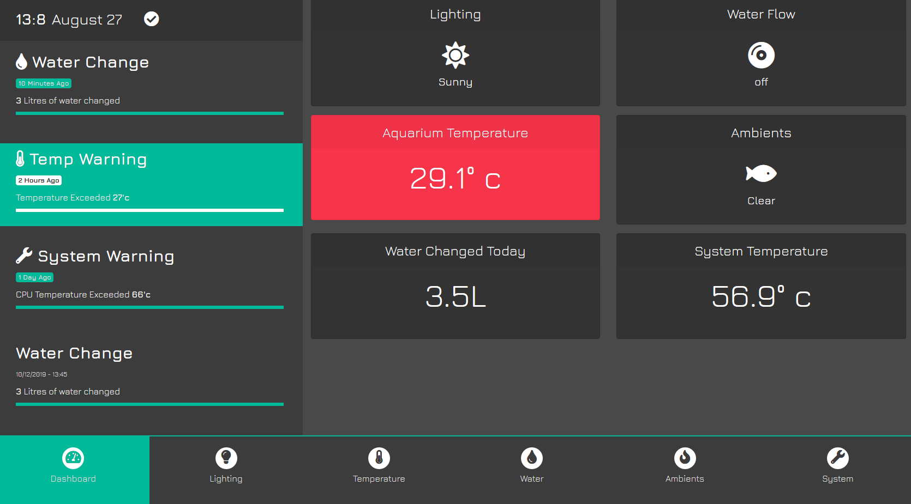
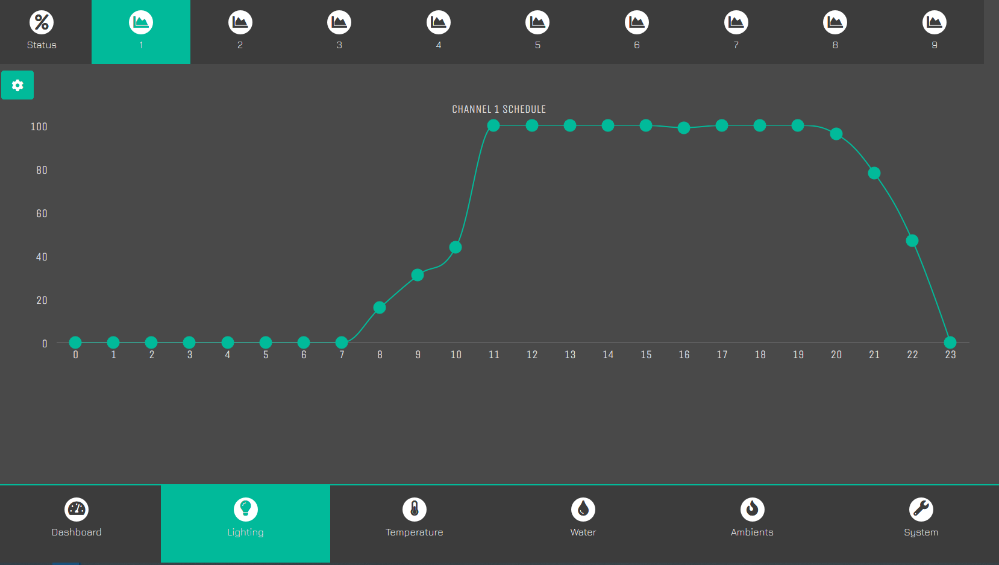
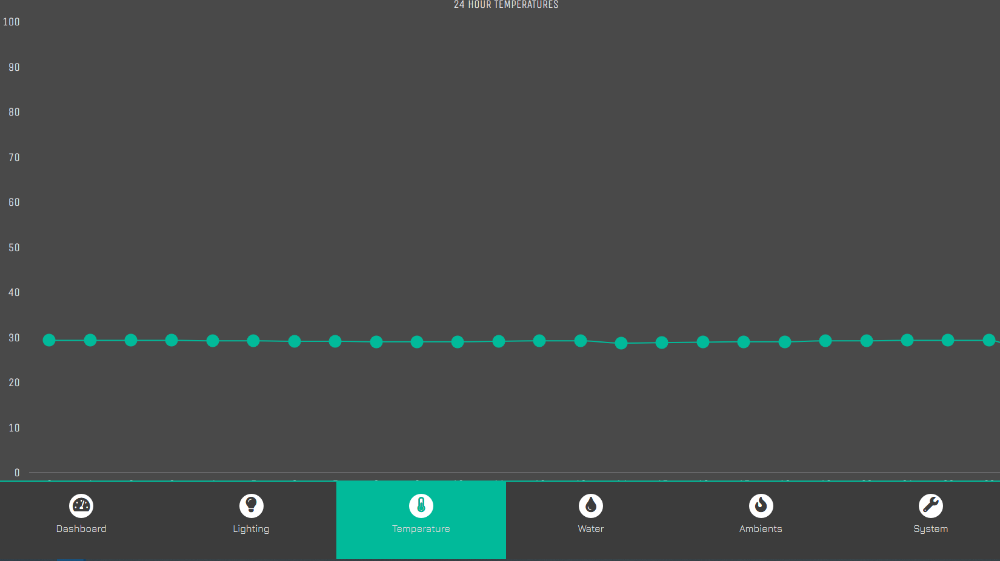
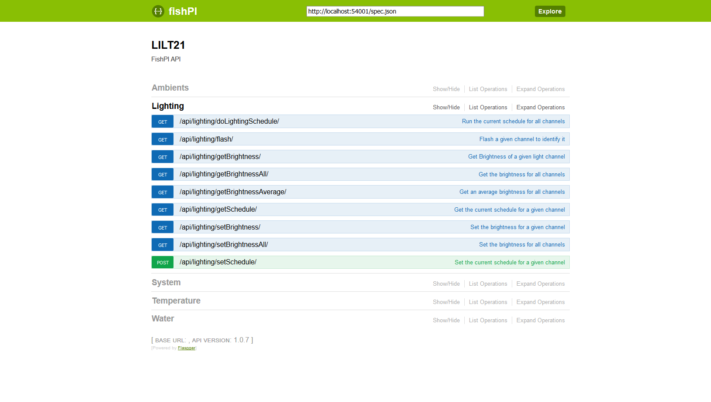

{:height="50%" width="50%"}
{:height="50%" width="50%"}
{:height="50%" width="50%"}
{:height="50%" width="50%"}

# FishPI 
## Aquarium touch screen interface and API for an

### Introduction
Fish PI is Actually version 3 of a design for a touch interface to drive an aquarium with an API backend allowing it's various functions to be connected to other IOT devices if required such as google home. 

Written in Python3 and running as a flask app with a flasgger swagger API. 

The App has dashboard and API controls for the following systems controlled by GPIO

- Lighting (10 channels by default) 
- Temperature sensor
- Water flow for water changes
- 2 GPIO controller relays used for water changes

### Features

- Full controllable lighting schedule with a drag and drop schedule graph
- Temperature logging to a graph
- Automatic per-hour water changes scheduled by a drag and drog graph. Managed by switching on a solenoid and reading given ticks from a HALL sensor, switching off when complete. 
- Ambients, allow for SFX and immersive modes such as Storm, Rain, Cloudy, and Nature mode. 
- Easy to see and visually pleasing dashboard with temperature, lighting information, system status etc

### Hardware

The hardware side is documented in a video which can be found here *link*

Essentially you can use these elements if installed and the required GPIO pins given in the config
- 10 lighting channels (one is reserved)
- HALL sensor for monitoring water flow
- 2 Relays for switching on a solenoid and optional rain bar
- Temperature sensor 

### Installation

#### Downloading

Clone this Repo into an installation location such as 

`/usr/share/fishpi`

Within the fishpi directory is a config.ini file which contains details about the pins you are using. 
Set the pins to any GPIO you want to use, include your lighting pins and sensor pins. 

#### Installing requirements

If starting from NOOBS you probably wont have pip3
`sudo apt-get python3-pip`

Clone to github repo and run 
`pip3 install -r requirements.txt`

#### Root free GPIO access

Install the requirements to access GPIO pins for non-root users. Create new file
`sudo nano /etc/udev/rules.d/50-gpio.rules`

insert the following

Reference: https://forum.up-community.org/discussion/2141/solved-tutorial-gpio-i2c-spi-access-without-root-permissions

` SUBSYSTEM=="gpio*", PROGRAM="/bin/sh -c '\  
    chown -R root:gpiouser /sys/class/gpio && chmod -R 770 /sys/class/gpio;\  
    chown -R root:gpiouser /sys/devices/virtual/gpio && chmod -R 770 /sys/devices/virtual/gpio;\  
    chown -R root:gpiouser /sys$devpath && chmod -R 770 /sys$devpath\ '"  
 `

now run

`
sudo groupadd gpiouser
`
`
sudo adduser pi gpiouser
`

This gives the standard PI user access to user GPIO pins without the need for root access. 

#### W1 Term Sensor Lib

W1ThermSensor is not installed via requirements.txt as it is available for certain OS but will cause errors if 
it was unable to find it the sensor installed. 

Install manually if you are running on a Raspberry PI 

`pip3 install W1ThermSensor`

#### RPi.GPIO

Same deal with RPI.GPIO. If running under windows as a test environment the lib is not available and would throw an error 
if installed by requirements.txt. To install for Raspberry PI run

`pip3 install RPi.GPIO`

Without this access to GPIO for switching on relays will not work. 

#### PI Blaster

Next we want to install pi-blaster which controls the PWM via software for lighting controls

[Follow the instrutions to build](https://github.com/sarfata/pi-blaster)

You probably, once compiled want to add a symbolic link to your /usr/bin/ directory allowing you call pi-blaster as
as a command. Ensure you have followed the instructions provided by sarfata to have pi-blaster auto start on boot. 

`sudo ln -s /home/pi/pi-blaster/pi-blaster /usr/bin/pi-blaster`

and finally you want to ensure pi-blaster on boot is configured to the correct pins. You can do this by adding to your
/etc/rc.local file

`sudo pi-blaster --gpio 13,27,19,21,26,20,16,12,7,5`

change your list of GPIO to the same pins you have configured for your lighting channels.

#### First Run

You should be able to boot fishpi for the first time

run `python3 /usr/share/fishpi/app.py`

FishPI will automaticly setup your Database on first boot and by default is available on port 54001

#### Start on Boot

You can configure a systemd auto start by copying the included fishpi.service file to

`sudo cp /usr/share/fishpi/fishpi.service /lib/systemd/system/fishpi.service`

`sudo chmod 644 /lib/systemd/system/fishpi.service`

`sudo systemctl enable fishpi.service`

`sudo systemctl daemon-reload`

`sudo service fishpi start` 

#### Using FishPI
Please see the video here for more information about using FishPI

#### Using FishPI API

You can access the swagger API dashboard by going to http://*IPADDRESS*:54001/apidocs

